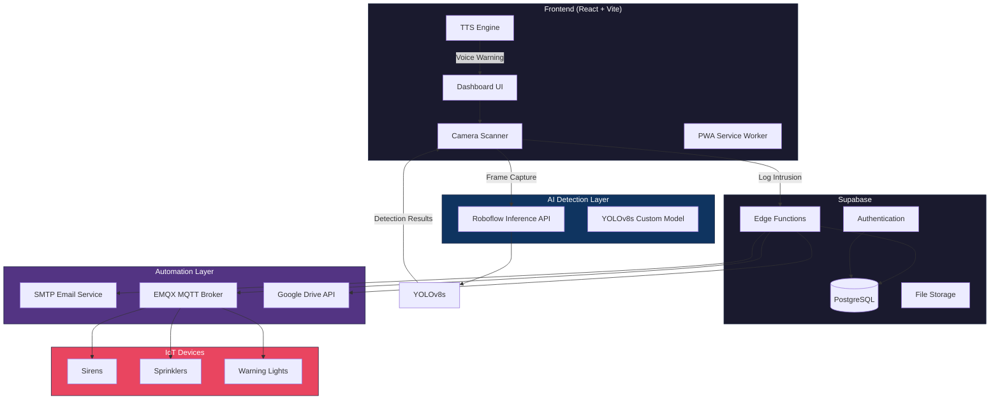

## This repository contains the reproducibility materials, experimental artifacts, implementation files, and supporting evidence associated with the study.

**Edge AI and IoT Enabled Livestock Intrusion Detection and Automated Farm Protection Using YOLOv8s and MQTT-Enabled Event Notification**

The project presents an integrated cyber-physical system for real-time cattle intrusion detection and automated farm protection. The system combines YOLOv8s-based visual detection, Python-based event orchestration, MQTT communication, ESP32-based actuation, and automated notification services.

## Repository Contents

### `manuscript_materials`

Supporting materials associated with the manuscript, including selected figures, demonstrations, and experimental evidence that are not included directly in the main manuscript.

### `experiments`

Materials used for model training, evaluation, and experimental analysis.

This includes the YOLOv8s training and evaluation notebook and generated experimental results used to obtain the measurements reported in the manuscript.

### `circuitry`

Hardware and simulation materials associated with the ESP32-based intrusion response system.

The Wokwi project files are provided for reproduction and inspection of the MQTT-enabled embedded control workflow.


## Dataset

The cattle detection dataset used in this study was obtained from Roboflow Universe.

The dataset used in the experiments contains 3,176 images and 9,441 cattle instances, with one object class (`cow`).

The original dataset is not relicensed or claimed as authors' property by this repository. Researchers should obtain the dataset from its original source and comply with its applicable licensing terms.

## Reproducibility

The repository provides the principal materials required to inspect and reproduce the computational and system-level experiments reported in the study, including:

- YOLOv8s training and evaluation notebook
- Model evaluation results
- Experimental latency measurements
- MQTT communication evaluation
- ESP32/Wokwi implementation files
- Custom detection, communication, and notification code
- Supporting experimental and demonstration materials

The training notebook contains the experimental procedures and calculations used to obtain the reported model-performance and latency measurements.

## External Resources

Some components of the system rely on externally hosted or third-party resources, including the Roboflow dataset and cloud-based services used during development and evaluation.


## License

This project is licensed under the **MIT License**. See the [LICENSE](LICENSE) file for details.

The MIT License applies to the original source code, configuration files, notebooks, simulation files, and other materials created by the authors and included in this repository.

Third-party materials, including the Roboflow dataset and other externally hosted resources, remain subject to their respective licenses and terms of use and are not relicensed by this repository.

## Citation

If you use this repository or build upon the implementation, please cite the associated research paper:

> Oladepo, C.O., Abeeb, A.B., and Habeebullahi, O.A. (2026). Edge AI and IoT Enabled Livestock Intrusion Detection and Automated Farm Protection Using YOLOv8s and MQTT-Enabled Event Notification. Discover Computer Vision (Under Review).

## Acknowledgement

This repository accompanies the research manuscript submitted to **Discover Computer Vision**.

---
---

<p align="center">
  
</p>

<p align="center">
  <strong>Automated Cattle Intrusion Detection and Control System</strong><br/>
  <em>AI-powered real-time cattle intrusion detection with automated deterrence</em>
</p>

<p align="center">
  
  
  
  
  
</p>

<p align="center">
  
  
  
  
</p>

---

## The Problem

Farmers across the globe lose **billions annually** due to crop damage from stray cattle intrusions. 
Traditional fencing is expensive, ineffective, and requires constant maintenance. 
Manual monitoring is impractical for large farms operating 24/7.

## The Solution

Automated Cattle Intrusion Detection and Control System is an intelligent farm surveillance system that combines **computer vision AI** with **automated deterrence mechanisms** to protect crops in real-time—without harming animals.

<p align="center">
  
</p>

---

## Features

<table>
<tr>
<td width="50%">

### AI Detection Engine
- **YOLOv8s** custom-trained model
- Real-time cattle detection via Roboflow
- Annotated evidence with bounding boxes
- Confidence scoring & multi-object tracking

</td>
<td width="50%">

### Smart Alerting
- **Push notifications** (Web Push API)
- **Email alerts** with annotated images
- **IoT/MQTT** trigger for sirens/sprinklers
- **Text-to-Speech** voice warnings

</td>
</tr>
<tr>
<td width="50%">

### Analytics Dashboard
- Real-time intrusion statistics
- Historical detection logs
- Sector-based monitoring
- Trend visualization with Recharts

</td>
<td width="50%">

### Cloud Integration
- **Google Drive** automatic backup
- Secure evidence archival
- Service Account authentication
- Organized folder structure

</td>
</tr>

</table>

---

## Architecture



---

## Tech Stack

### Frontend
| Technology | Purpose |
|------------|---------|
|  | Component-based UI framework |
|  | Type-safe JavaScript |
|  | Next-gen build tooling |
|  | Utility-first styling |
|  | Accessible component library |
|  | 3D visualization engine |
|  | Animation library |

### Backend & Infrastructure
| Technology | Purpose |
|------------|---------|
|  | Backend-as-a-Service |
|  | Relational database |
|  | Edge function runtime |
|  | Secure authentication |

### AI & Machine Learning
| Technology | Purpose |
|------------|---------|
|  | ML model hosting & inference |
|  | Object detection model |
|  | Image processing |

### Integrations
| Technology | Purpose |
|------------|---------|
|  | MQTT broker for IoT |
|  | Cloud evidence storage |
|  | Email notifications |
|  | Browser notifications |

---

## Quick Start

### Prerequisites

```bash
node >= 18.0.0
npm >= 9.0.0
```

### Installation

```bash
# Clone the repository
git clone https://github.com/yourusername/acids.git

# Navigate to project directory
cd acids

# Install dependencies
npm install

# Start development server
npm run dev
```

### Environment Variables

Create a `.env` file in the root directory:

```env
VITE_SUPABASE_URL=your_supabase_url
VITE_SUPABASE_PUBLISHABLE_KEY=your_anon_key
```

---

## Automations

ACIDS supports multiple automation channels that trigger simultaneously upon detection:

### Email Alerts (SMTP)
```typescript
// Sends annotated detection image via TLS-secured SMTP
{
  host: "smtp.gmail.com",
  port: 587,
  secure: true, // STARTTLS
  attachments: [annotatedImage]
}
```

### IoT Triggers (EMQX MQTT)
```typescript
// Publishes to MQTT topic for hardware activation
POST /api/v5/publish
{
  topic: "caleb/farm-test",
  payload: { detected: true, count: 3, sector: "North Field" }
}
```

### Google Drive Backup
```typescript
// Service Account OAuth2 → JWT → Access Token → Upload
// Automatic evidence archival with timestamps
```

### Voice Deterrent (TTS)
```typescript
// Browser-native speech synthesis
speechSynthesis.speak(new SpeechSynthesisUtterance(
  "Warning! Cattle intrusion detected. Deterrent systems activated."
));
```

---

## API Reference

### Edge Functions

| Endpoint | Method | Description |
|----------|--------|-------------|
| `/detect-cattle` | POST | Process image through YOLOv8 |
| `/send-alert-email` | POST | Send SMTP email with attachment |
| `/trigger-iot-alarm` | POST | Publish to EMQX MQTT broker |
| `/upload-to-gdrive` | POST | Upload evidence to Google Drive |

### Detection Request
```typescript
POST /functions/v1/detect-cattle
Content-Type: application/json

{
  "imageBase64": "data:image/jpeg;base64,/9j/4AAQ...",
  "annotate": true
}
```

### Detection Response
```typescript
{
  "detected": true,
  "count": 3,
  "predictions": [
    {
      "class": "cattle",
      "confidence": 0.94,
      "x": 245, "y": 180,
      "width": 120, "height": 95
    }
  ],
  "annotatedImageBase64": "data:image/jpeg;base64,..."
}
```

---

## Project Structure

```
acids/
├── 📂 src/
│   ├── 📂 assets/              # Static images & assets
│   ├── 📂 components/          # React components
│   │   ├── 📂 ui/              # shadcn/ui components
│   │   ├── AuthPage.tsx        # Authentication
│   │   ├── Dashboard.tsx       # Main dashboard
│   │   ├── ScannerPanel.tsx    # AI detection interface
│   │   └── Automation3DScene.tsx # Three.js visualization
│   ├── 📂 contexts/            # React contexts
│   ├── 📂 hooks/               # Custom hooks
│   ├── 📂 pages/               # Route pages
│   ├── 📂 types/               # TypeScript definitions
│   └── 📂 integrations/        # Supabase client
├── 📂 supabase/
│   ├── 📂 functions/           # Deno edge functions
│   │   ├── detect-cattle/
│   │   ├── send-alert-email/
│   │   ├── trigger-iot-alarm/
│   │   └── upload-to-gdrive/
│   └── config.toml
├── 📂 public/                  # PWA assets
└── 📄 vite.config.ts           # Build configuration
```

---

---

## 🔒 Security

- **Row Level Security (RLS)** on all database tables
- **JWT-based authentication** with Supabase Auth
- **Service Account isolation** for Google Drive
- **TLS/STARTTLS** encryption for SMTP
- **HTTPS-only** API communications

---

## Roadmap

- [ ] Multi-camera support with stream aggregation
- [ ] Custom model training interface
- [ ] SMS/WhatsApp alert integration
- [ ] Solar-powered edge device deployment
- [ ] Drone patrol integration
- [ ] Multi-language voice deterrents

---


```bash
# Fork the repository
# Create your feature branch
git checkout -b feature/amazing-feature

# Commit your changes
git commit -m 'Add amazing feature'

# Push to the branch
git push origin feature/amazing-feature

# Open a Pull Request
```

---

